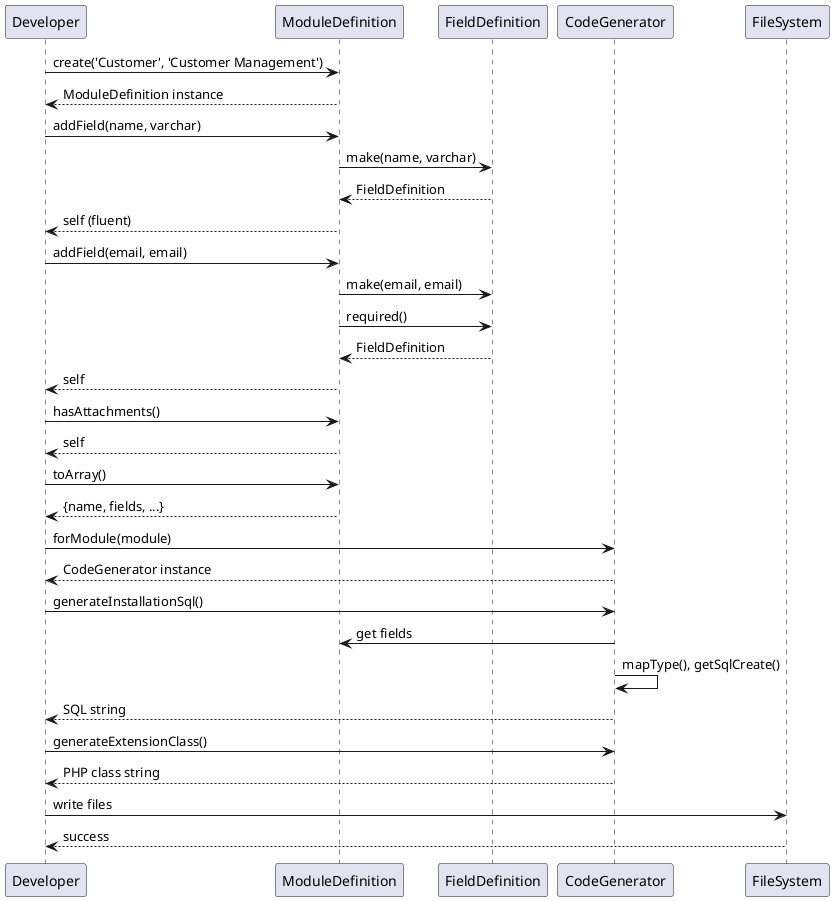

# ksf_ModuleBuilder - Architecture

## Document Information

| Field | Value |
|-------|-------|
| **Document ID** | ARCH-MODULE-001 |
| **Module** | ksf_ModuleBuilder |
| **Project** | Module Builder/Generator |
| **Version** | 1.0.0 |
| **Author** | KS Fraser Development Team |
| **Created** | 2024-01-15 |

---

## 1. Technical Architecture Overview

### 1.1 Architecture Pattern
The ksf_ModuleBuilder module follows **Builder Pattern** combined with **Factory Pattern** for code generation. It uses fluent interfaces for module definition and generates code through dedicated generator classes.

### 1.2 Module Classification
- **Type**: Code Generation Framework
- **Namespace**: `Ksfraser\ModuleBuilder`
- **Platform**: Standalone (PHP 7.3+)

### 1.3 Architecture Layers

```
┌──────────────────────────────────────────────────────────────┐
│                    USER INTERFACE LAYER                     │
│  ┌────────────────────────────────────────────────────────┐  │
│  │  Module Definition (Fluent API)                       │  │
│  │  - ModuleDefinition                                    │  │
│  │  - FieldDefinition                                     │  │
│  └────────────────────────────────────────────────────────┘  │
└──────────────────────────────────────────────────────────────┘
                              │
                              ▼
┌──────────────────────────────────────────────────────────────┐
│                    GENERATION LAYER                          │
│  ┌────────────────────────────────────────────────────────┐  │
│  │  CodeGenerator                                         │  │
│  │  - generateInstallationSql()                           │  │
│  │  - generateUninstallationSql()                         │  │
│  │  - generateAccessSql()                                 │  │
│  │  - generateFAExtensionClass()                           │  │
│  │  - generateHookFile()                                  │  │
│  │  - generateFormView()                                  │  │
│  │  - generateJsonConfig()                               │  │
│  └────────────────────────────────────────────────────────┘  │
└──────────────────────────────────────────────────────────────┘
                              │
                              ▼
┌──────────────────────────────────────────────────────────────┐
│                    OUTPUT LAYER                              │
│  ┌────────────────────────────────────────────────────────┐  │
│  │  Generated Code Files:                                  │  │
│  │  - SQL Scripts (.sql)                                   │  │
│  │  - PHP Extension Classes (.php)                        │  │
│  │  - Hook Files (.php)                                    │  │
│  │  - Form Views (.php)                                    │  │
│  │  - JSON Configuration (.json)                          │  │
│  └────────────────────────────────────────────────────────┘  │
└──────────────────────────────────────────────────────────────┘
```

---

## 2. Class Diagram

### 2.1 Core Classes

```
┌─────────────────────────────────────────────────────────────┐
│                    ModuleDefinition                         │
├─────────────────────────────────────────────────────────────┤
│ + name: string                                              │
│ + table: string                                             │
│ + prefix: string                                            │
│ + label: string                                              │
│ + description: string                                       │
│ + version: string                                           │
│ + has_attachments: bool                                     │
│ + has_comments: bool                                        │
│ + has_workflow: bool                                        │
│ + has_revision: bool                                        │
│ + fields: array                                             │
│ + relations: array                                          │
│ + permissions: array                                        │
│ + workflow_triggers: array                                  │
│ + hooks: array                                              │
├─────────────────────────────────────────────────────────────┤
│ + create(name, label): self                                 │
│ + table(table): self                                        │
│ + prefix(prefix): self                                       │
│ + description(desc): self                                   │
│ + version(ver): self                                        │
│ + hasAttachments(bool): self                                │
│ + hasComments(bool): self                                   │
│ + hasWorkflow(bool): self                                    │
│ + hasRevision(bool): self                                   │
│ + addField(field): self                                     │
│ + addRelation(relation): self                               │
│ + addPermission(perm): self                                 │
│ + addWorkflowTrigger(trigger): self                         │
│ + addHook(hook): self                                       │
│ + getSqlCreate(): string                                    │
│ + toArray(): array                                          │
│ + fromArray(data): self                                     │
└─────────────────────────────────────────────────────────────┘
                              │
                              │ contains
                              ▼ 0..*
┌─────────────────────────────────────────────────────────────┐
│                    FieldDefinition                           │
├─────────────────────────────────────────────────────────────┤
│ + name: string                                              │
│ + type: string                                              │
│ + label: ?string                                            │
│ + required: bool                                            │
│ + default: mixed                                            │
│ + length: ?int                                              │
│ + options: array                                            │
│ + unique: bool                                              │
│ + indexed: bool                                              │
│ + validation: ?string                                        │
├─────────────────────────────────────────────────────────────┤
│ + make(name, type): self                                    │
│ + label(label): self                                        │
│ + required(bool): self                                      │
│ + default(value): self                                       │
│ + length(len): self                                         │
│ + options(opts): self                                       │
│ + unique(bool): self                                        │
│ + indexed(bool): self                                        │
│ + validation(rules): self                                   │
│ + toArray(): array                                          │
│ + fromArray(data): self                                     │
└─────────────────────────────────────────────────────────────┘
                              │
                              │ generates
                              ▼
┌─────────────────────────────────────────────────────────────┐
│                    CodeGenerator                            │
├─────────────────────────────────────────────────────────────┤
│ - module: ModuleDefinition                                  │
├─────────────────────────────────────────────────────────────┤
│ + forModule(module): self                                  │
│ + generateInstallationSql(): string                        │
│ + generateUninstallationSql(): string                      │
│ + generateAccessSql(): string                              │
│ + generateFAExtensionClass(): string                       │
│ + generateHookFile(): string                               │
│ + generateFormView(): string                               │
│ + generateJsonConfig(): string                             │
│ - generateRelationSql(relation): string                    │
└─────────────────────────────────────────────────────────────┘
```

### 2.2 Factory Pattern

```
┌─────────────────────────────────────────────────────────────┐
│              ModuleDefinition::create()                     │
├─────────────────────────────────────────────────────────────┤
│  Factory method for creating module definitions            │
├─────────────────────────────────────────────────────────────┤
│  public static function create(string $name, string $label)│
│      : ModuleDefinition                                    │
└─────────────────────────────────────────────────────────────┘
                              │
                              │ uses
                              ▼
┌─────────────────────────────────────────────────────────────┐
│              FieldDefinition::make()                        │
├─────────────────────────────────────────────────────────────┤
│  Factory method for creating field definitions            │
├─────────────────────────────────────────────────────────────┤
│  public static function make(string $name, string $type)   │
│      : FieldDefinition                                     │
└─────────────────────────────────────────────────────────────┘
                              │
                              │ uses
                              ▼
┌─────────────────────────────────────────────────────────────┐
│              CodeGenerator::forModule()                    │
├─────────────────────────────────────────────────────────────┤
│  Factory method for creating code generator                │
├─────────────────────────────────────────────────────────────┤
│  public static function forModule(ModuleDefinition $module)│
│      : CodeGenerator                                       │
└─────────────────────────────────────────────────────────────┘
```

---

## 3. Data Flow

### 3.1 Module Definition Flow

```
┌─────────────┐    ┌──────────────────┐    ┌─────────────────┐
│  Developer  │───▶│ ModuleDefinition │───▶│  FieldDefinition│
│  (User)     │    │   (Builder)      │    │   (Collection) │
└─────────────┘    └──────────────────┘    └─────────────────┘
                          │
                          │ addField()
                          ▼
                   ┌─────────────────┐
                   │  Field List     │
                   │  [field1,       │
                   │   field2, ...]  │
                   └─────────────────┘
                          │
                          │ addRelation()
                          ▼
                   ┌─────────────────┐
                   │  Relations     │
                   │  [rel1, rel2]   │
                   └─────────────────┘
```

### 3.2 Code Generation Flow

```
┌──────────────────┐    ┌─────────────────┐    ┌─────────────────┐
│ ModuleDefinition │───▶│ CodeGenerator   │───▶│ Generated Code  │
│ (Input)          │    │ (Transformer)  │    │ (Output)        │
└──────────────────┘    └─────────────────┘    └─────────────────┘
       │                      │                      │
       │ toArray()            │ transform()         │ write files
       ▼                      ▼                      ▼
┌──────────────────┐    ┌─────────────────┐    ┌─────────────────┐
│  Definition      │    │  SQL Templates  │    │  - install.sql  │
│  Array           │    │  PHP Templates  │    │  - install.php  │
│                  │    │  HTML Templates │    │  - hooks.php    │
│                  │    │                 │    │  - form.php     │
└──────────────────┘    └─────────────────┘    └─────────────────┘
```

### 3.3 SQL Generation Flow

```
┌──────────────────┐
│ FieldDefinition │
│ (name, type,    │
│  required, etc) │
└────────┬────────┘
         │
         ▼
┌─────────────────────────────────────────────────────────────┐
│ ModuleDefinition::getSqlCreate()                            │
├─────────────────────────────────────────────────────────────┤
│ 1. Start with CREATE TABLE statement                        │
│ 2. Add primary key (id)                                    │
│ 3. For each field:                                        │
│    - Map type to SQL type                                  │
│    - Add length for varchar                                │
│    - Add DEFAULT for default values                        │
│    - Add NOT NULL for required                             │
│    - Add UNIQUE for unique fields                         │
│ 4. Add audit columns (created_at, updated_at, etc.)       │
│ 5. Add active column                                      │
│ 6. Add indexes for indexed fields                         │
│ 7. Return complete SQL                                    │
└─────────────────────────────────────────────────────────────┘
```

---

## 4. Type Mapping

### 4.1 PHP to SQL Type Mapping

```php
private function mapType(string $type): string
{
    return match ($type) {
        'varchar' => 'VARCHAR',
        'text' => 'TEXT',
        'int', 'integer' => 'INT',
        'bigint' => 'BIGINT',
        'decimal' => 'DECIMAL(10,2)',
        'float' => 'FLOAT',
        'boolean', 'bool' => 'TINYINT(1)',
        'date' => 'DATE',
        'datetime' => 'DATETIME',
        'timestamp' => 'TIMESTAMP',
        'email' => 'VARCHAR(255)',
        'phone' => 'VARCHAR(50)',
        'url' => 'VARCHAR(500)',
        'json' => 'JSON',
        'file' => 'VARCHAR(500)',
        'enum' => 'ENUM',
        default => 'VARCHAR(255)',
    };
}
```

### 4.2 Type Mapping Table

| PHP Type | SQL Type | Requires Length | Default |
|----------|----------|-----------------|---------|
| varchar | VARCHAR | Yes | 255 |
| text | TEXT | No | - |
| int | INT | No | 0 |
| bigint | BIGINT | No | 0 |
| decimal | DECIMAL(10,2) | No | 0.00 |
| float | FLOAT | No | 0.0 |
| boolean | TINYINT(1) | No | 0 |
| date | DATE | No | - |
| datetime | DATETIME | No | - |
| timestamp | TIMESTAMP | No | CURRENT_TIMESTAMP |
| email | VARCHAR(255) | No | - |
| phone | VARCHAR(50) | No | - |
| url | VARCHAR(500) | No | - |
| json | JSON | No | - |
| file | VARCHAR(500) | No | - |
| enum | ENUM | No | - |

---

## 5. File Structure

### 5.1 Module Directory Structure

```
ksf_ModuleBuilder/
├── ProjectDcs/
│   ├── ProjectDcs/
│   │   ├── Business Requirements.md
│   │   ├── Architecture.md
│   │   ├── Functional Requirements.md
│   │   ├── Use Case.md
│   │   ├── Test Plan.md
│   │   └── UAT Plan.md
│   ├── BABOK/
│   ├── UML/
│   └── RTM/
├── src/
│   └── Ksfraser/
│       └── ModuleBuilder/
│           ├── ModuleDefinition.php
│           ├── FieldDefinition.php
│           └── CodeGenerator.php
├── tests/
│   └── Unit/
├── demo.php
├── composer.json
├── phpunit.xml
└── README.md
```

### 5.2 Generated Module Structure

```
ksf_<ModuleName>/
├── sql/
│   ├── install.sql
│   └── uninstall.sql
├── includes/
│   ├── FA{Module}.php
│   └── {module}_hooks.php
├── pages/
│   └── {module}.php
├── ProjectDcs/
│   └── (documentation)
├── tests/
│   └── (module tests)
└── composer.json
```

---

## 6. Generated Code Specifications

### 6.1 SQL Installation Script

```sql
CREATE TABLE IF NOT EXISTS {prefix}{table} (
    id INT AUTO_INCREMENT PRIMARY KEY,
    {field1_name} {field1_type}{length} {nullable} {default},
    {field2_name} {field2_type}{length} {nullable} {default},
    ...
    file_path VARCHAR(255),      -- if has_attachments
    file_name VARCHAR(255),      -- if has_attachments
    comment_count INT DEFAULT 0, -- if has_comments
    revision INT DEFAULT 0,      -- if has_revision
    created_at DATETIME DEFAULT CURRENT_TIMESTAMP,
    updated_at DATETIME DEFAULT CURRENT_TIMESTAMP ON UPDATE CURRENT_TIMESTAMP,
    created_by VARCHAR(50),
    updated_by VARCHAR(50),
    active INT DEFAULT 1
) ENGINE=InnoDB DEFAULT CHARSET=utf8mb4;

CREATE INDEX idx_{field_name} ON {prefix}{table}({field_name});
```

### 6.2 Extension Class

```php
class FA{ModuleName}
{
    public static $table = '{prefix}{table}';
    public static $prefix = '{prefix}';
    public static $module_name = '{name}';
    
    public static function install() { ... }
    public static function uninstall() { ... }
    public static function get_access() { ... }
    public static function can_view() { ... }
    public static function can_edit() { ... }
    public static function can_delete() { ... }
    public static function add($data) { ... }
    public static function update($id, $data) { ... }
    public static function delete($id) { ... }
    public static function get($id) { ... }
    public static function get_all($filter = []) { ... }
}
```

### 6.3 Hook File

```php
<?php

add_menu_entry('{name}', '{label}', '{name}');

function ksf_fa_{nameLower}_install()
{
    FA{ModuleName}::install();
}

function ksf_fa_{nameLower}_uninstall()
{
    FA{ModuleName}::uninstall();
}

// Custom hooks registered here
```

---

## 7. Design Patterns Used

### 7.1 Builder Pattern
ModuleDefinition uses fluent interface (Builder Pattern) for step-by-step configuration:
```php
$module = ModuleDefinition::create('Customer', 'Customer')
    ->description('Customer management')
    ->hasAttachments()
    ->addField(FieldDefinition::make('name', 'varchar'));
```

### 7.2 Factory Pattern
Static factory methods for object creation:
```php
$field = FieldDefinition::make('email', 'email')->required();
$generator = CodeGenerator::forModule($module);
```

### 7.3 Template Method Pattern
CodeGenerator contains template methods for generating different code types:
- `generateInstallationSql()` - SQL template
- `generateExtensionClass()` - PHP template
- `generateFormView()` - HTML template

### 7.4 Strategy Pattern
Different field types are handled by the same interface with different strategies:
- Type mapping strategy
- Validation strategy
- Indexing strategy

---

## 8. UML Sequence Diagram

### 8.1 Module Creation Sequence



---

## 9. Extension Points

### 9.1 Custom Field Types
Extend type mapping by subclassing ModuleDefinition:
```php
class CustomModuleDefinition extends ModuleDefinition
{
    protected function mapType(string $type): string
    {
        if ($type === 'custom_type') {
            return 'CUSTOM_SQL_TYPE';
        }
        return parent::mapType($type);
    }
}
```

### 9.2 Custom Templates
Extend code generation by subclassing CodeGenerator:
```php
class CustomCodeGenerator extends CodeGenerator
{
    protected function generateCustomFeature(): string
    {
        // Custom feature generation
    }
}
```

### 9.3 Validation Rules
Add custom validation:
```php
$field->validation('custom_rule');
// Processed by custom validator
```

---

**Document Owner**: KS Fraser Development Team  
**Review Status**: Pending